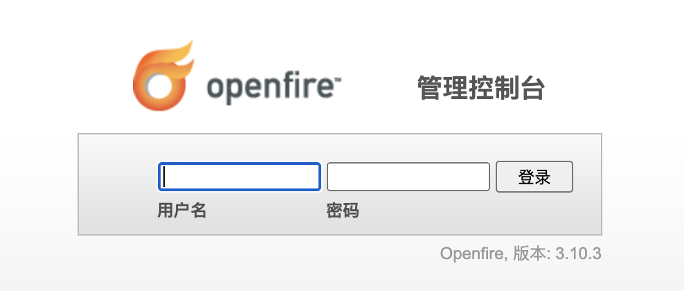
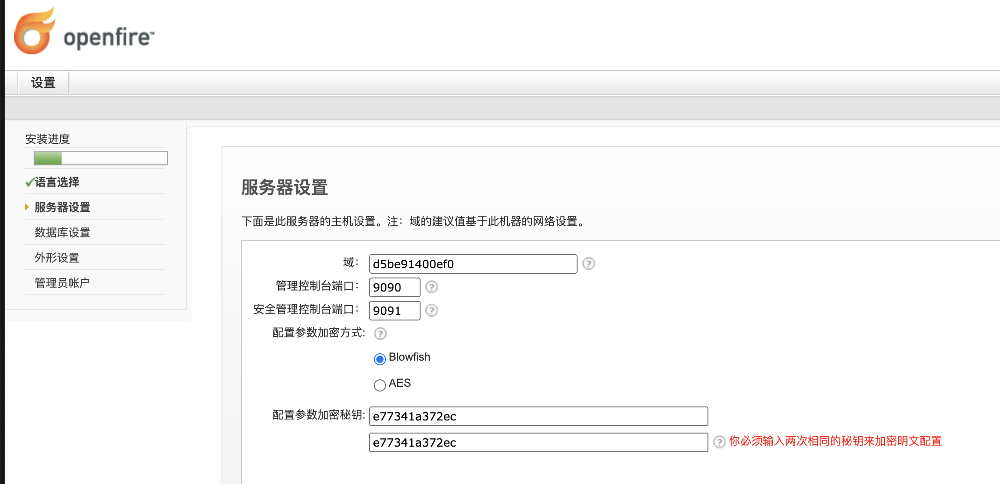
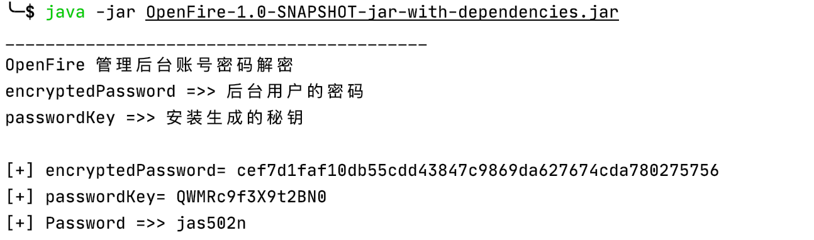

# OpenFire_Decrypt
OpenFire 管理后台账号密码解密


## install openfire
https://hub.docker.com/r/sameersbn/openfire

`docker pull sameersbn/openfire:3.10.3-19`

```
docker run --name openfire -d --restart=always \
  --publish 9090:9090 --publish 5222:5222 --publish 7777:7777 \
  --volume /srv/docker/openfire:/var/lib/openfire \
  sameersbn/openfire:3.10.3-19
```





`/usr/share/openfire/embedded-db/openfire.log`

```
/*C3*/INSERT INTO OFPROPERTY VALUES('passwordKey','QWMRc9f3X9t2BN0')
/*C1*/DELETE FROM OFUSER WHERE USERNAME='admin'
INSERT INTO OFUSER VALUES('admin',NULL,'cef7d1faf10db55cdd43847c9869da627674cda780275756','Administrator','admin@example.com','0','0')
```

`select encryptedPassword from OFUSER where username='admin';`

`select * from ofproperty where propValue='passwordKey' `


**`encryptedPassword`**  **`passwordKey`**
```
String encryptedPassword = "cef7d1faf10db55cdd43847c9869da627674cda780275756";
String passwordKey = "QWMRc9f3X9t2BN0";
```

## Decrypt

`mvn clean package -DskipTests`




## 参考链接：

https://www.ch1ng.com/blog/199.html
